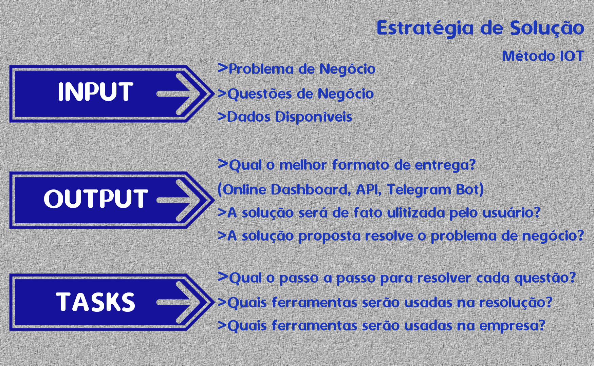
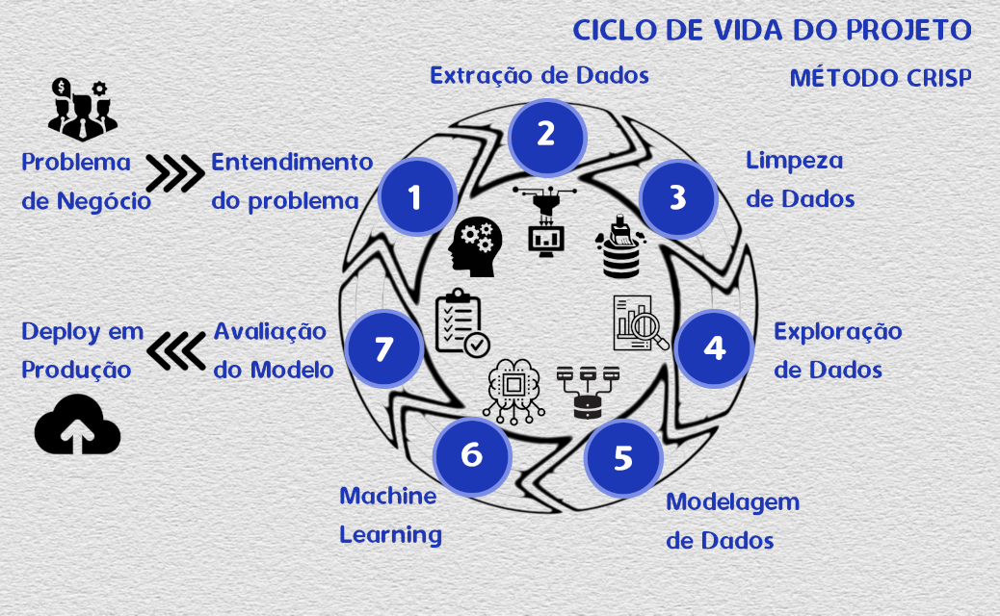
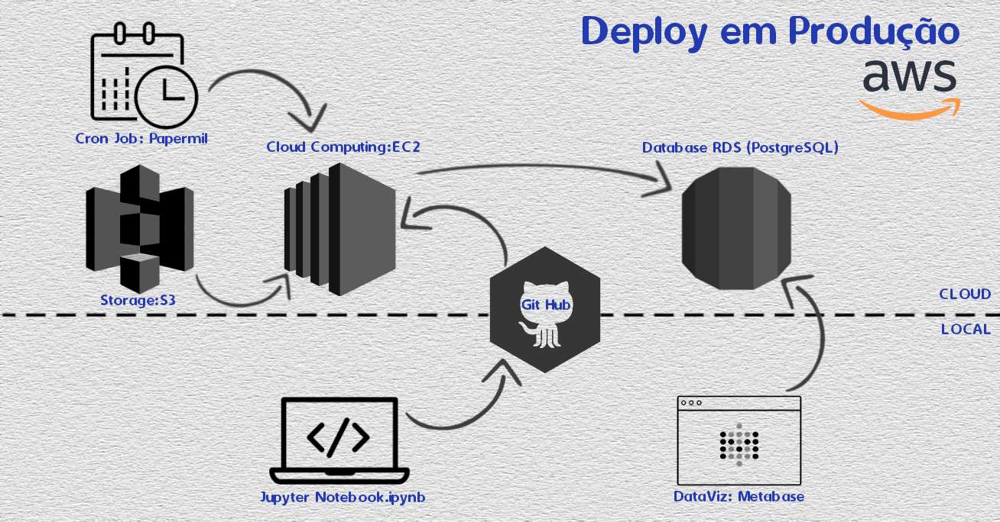
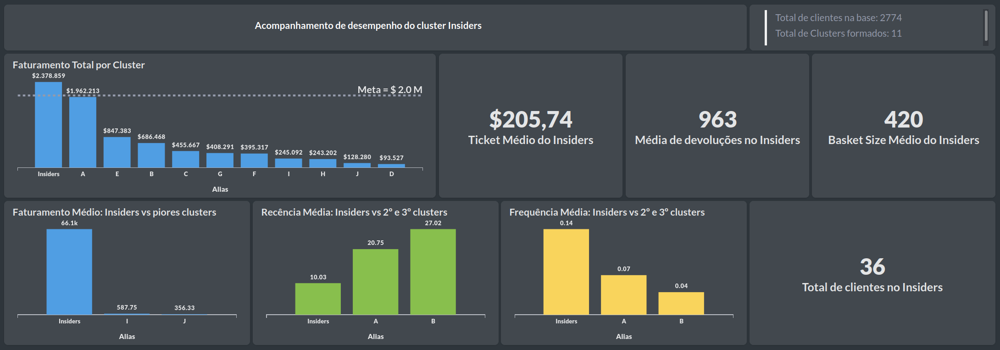

# **ENTENDIMENTO DO NEGÓCIO**

## **QUAL É A EMPRESA?**

`All In One Place`

## **QUAL É O MODELO DE NEGÓCIO?**

A All in One Place é uma empresa `outlet` multimarcas que vende produtos de segunda linha de várias marcas a um preço mais baixo por meio de um `e-commerce`.

## **QUAL É O PROBLEMA DE NEGÓCIO?**

Em pouco mais de 1 ano de operação, o time de marketing percebeu que alguns clientes da sua base compram produtos mais caros, com alta frequência e acabam contribuindo com uma parcela significativa do faturamento da empresa.

Baseado nessa percepção, o time de marketing vai lançar um `programa de fidelidade` para os melhores clientes da base, chamado `Insiders`. Mas o time não tem um conhecimento avançado em análise de dados para eleger os participantes do programa.

Por esse motivo, o time de marketing requisitou ao time de dados uma seleção de clientes elegíveis ao programa, usando técnicas avançadas de manipulação de dados.

**Referências:**  
https://sejaumdatascientist.com/como-criar-um-programa-de-fidelidade-para-empresa/


# **ENTENDIMENTO DO PROBLEMA**

## **QUAL O DESAFIO QUE ESTE PROJETO VISA SUPERAR?**

O time de cientistas de dados da empresa All In One Place precisa sugerir quem serão os clientes elegíveis para participar do Insiders. Em posse dessa lista, o time de Marketing fará uma sequência de ações personalizadas e exclusivas ao grupo, de modo a aumentar o faturamento e a frequência de compra.

Como resultado para esse projeto, é esperada a entrega de uma lista de pessoas elegíveis a participar do programa Insiders, junto com um relatório respondendo às seguintes perguntas:

* *Quem são as pessoas elegíveis para participar do programa de Insiders?*
* *Quantos clientes farão parte do grupo?*
* *Quais as principais características desses clientes?*
* *Qual a porcentagem de contribuição do faturamento, vinda do Insiders?*
* *Quais as condições para uma pessoa ser elegível ao Insiders?*
* *Quais as condições para uma pessoa ser removida do Insiders?*


# **BUSINESS ASSUMPTIONS**
```
- compras com quantity negativo serão tratadas separadamente

- compras com price zero não serão consideradas (removidas)

- compras cujos items não possuem description não serão consideradas (removidas)

- compras cujo customer id é deconhecido não serão consideradas (removidas),
já que não poderão ser identificados posteriormente

- o atributo quantity negativo significa uma devolução do produto e consequentemente
a empresa precisa reembolsar o cliente, o que implica que o atributo price
também tenha um valor negativo

- clientes que retornam mais produtos do que compram não serão considerados (removidos).
Isso indica que o recorte temporal dos dados colhidos não conseguiu capturar as compras
anteriores feitas por estes clientes

- items cujo stock code possuem apenas caracteres alfabéticos (como W',  'CRUK',  'J',  'BL')
parecem não possuir um produto relacionado. Estes itens não serão considerados nos cálculos
do total de itens comprados por cliente

- items com stock codes como 47566 e 47566B serão tratados como produtos diferentes

- a unidade monetária utilizada foi o dólar americano

- compras cujo invoice_no começam com a letra C indicam uma transação com quantity negativo,
portanto serão tratadas isoladamente.
```
### **O dataset possui as seguintes features**

|Feature      | Definição     |
|-------------| ------------- |
|InvoiceNo    | identificador único para cada transação |
|StockCode    | código de produto (item) |
|Description  | nome e descrição do produto |
|Quantity     | quantidade de items de cada produto por transação |
|InvoiceDate  | data (dia) em que foi realizada a transação |
|UnitPrice    | preço unitário de cada produto (item) |
|CustomerID   | identificador único para cada cliente |
|Country      | nome do país onde o cliente reside | <br>

**Referências:**  
https://www.kaggle.com/vik2012kvs/high-value-customers-identification

# **ESTRATÉGIA DA SOLUÇÃO**



### Input

- **Business problem**: segmentar os clientes em grupos e encontrar aqueles mais valiosos.
- **Business questions**: descritos na seção anterior
- **Dados disponíveis**: dataset de transações que ocorreram entre Nov-2016 e Dec-2017.

### Output

- **Dashboard** com informações do grupo Insiders
- **Relatório** com as respostas para as seguintes perguntas de negócio:
* *Quem são as pessoas elegíveis para participar do programa de Insiders?*
* *Quantos clientes farão parte do grupo?*
* *Quais as principais características desses clientes?*
* *Qual a porcentagem de contribuição do faturamento, vinda do Insiders?*
* *Quais as condições para uma pessoa ser elegível ao Insiders?*
* *Quais as condições para uma pessoa ser removida do Insiders?*


### Tasks
> Quem são as pessoas elegíveis para participar do programa de Insiders?

* O que significa ser elegível? Para a empresa, o que é exatamente um cliente valioso?
* Assumiremos que alto valor seja sinônimo de Lifetime Value (LTV)

> Quantos clientes farão parte do grupo?

 * Determinar o cluster Insiders  
 * Contar quantos clientes estão no grupo e qual o percentual em relação ao número total de clientes  

> Quais as principais características desses clientes?

* Determinar o cluster Insiders
* Descrever os clientes do grupo em termos dos valores médios dos atributos utilizados na clusterização

> Qual a porcentagem de contribuição do faturamento, vinda do Insiders?

* Determinar o cluster Insiders
* Calcular o faturamento acumulado obtido pelo grupo e dividir pelo faturamento total obtido pela base

> Quais as condições para uma pessoa ser elegível ao Insiders?

* Determinar o cluster Insiders
* Determinar o intervalo de confiança (de variação dos atributos) a ser considerado para elegibilidade e verificar o quão próximo da média do grupo está o comportamento do cliente

> Quais as condições para uma pessoa ser removida do Insiders?

* Determinar o cluster Insiders
* Determinar o intervalo de confiança (de variação dos atributos) a ser considerado para elegibilidade e verificar o quão longe da média do grupo está o comportamento do cliente


# **CICLO DO PROJETO**



## `Step 00. Settings and Data Extraction`
* Importação das bibliotecas, pacotes e funções necessárias.
* Carregamento e verificação dos dados disponíveis através de um arquivo CSV.

## `Step 01. Data Description`
* Renomeação das colunas e verificação do tamanho do dataset (avaliar a necessidade de ferramentas para tratar grande volume de dados).
* Verificação dos tipos de dados em cada coluna e mudanças de tipo que se façam necessárias para melhor tratamento pelos algoritmos posteriormente
* Verificação de dados faltantes e decisão de como tratá-los (remoção, reamostragem artificial, inviabilidade da solução)
* Breve descrição estatística dos atributos numéricos e categóricos a fim de detectar anomalias que fogem do escopo do problema, bem como a presença de possíveis outliers que irão impactar a performance dos algoritmos posteriormente.

## `Step 02. Data Filtering`
* Filtragem de linhas e deleção de colunas que não contém informações relevantes para a modelagem ou não ajudam a resolver o problema.

## `Step 03. Feature Engineering`
Criação de variáveis (features) relevantes para a resolução do problema

## `Step 04. Exploratory Data Analysis`
* Análise isolada de cada feature e sua relação com as demais.
* Exploração dos dados a fim de obter uma intuição da distribuição dos mesmos no espaço de dados (exploração de embedding).

## `Step 05. Data Preparation`
* Preparação dos dados a fim de ajudar os modelos de machine learning a aprenderem e performarem com maior acurácia.
* Seleção do espaço de embedding mais adequado ao problema

## `Step 06. Feature Selection`
* Seleção das features mais relevantes para treinar os modelos.

## `Step 07. Hyperparameter Fine Tuning`
* Teste de diferentes modelos de machine learning e seleção daquele que apresenta a melhor performance baseado nas métricas escolhidas (silhouette score)
* Escolha dos melhores valores para cada parâmetro dos modelos testados que maximizam a performance

## `Step 08. Model Training`
* Treino dos modelos com os melhores parâmetros encontrados e medição da sua performance

## `Step 09. Cluster Analysis`
* Inspeção visual do espaço de dados montado por cada modelo
* Análise do profile (atributos) de cada cluster para cada modelo treinado
* Escolha do modelo final que apresenta a melhor performance

## `Step 10. Exploratory Data Analysis for Business`
* Criação e teste das hipóteses de negócio e elaboração das respostas para as perguntas de negócio

## `Step 11. Deploy to Production`
* Planejamento e implementação da arquitetura de deploy do modelo
* Criação do banco de dados que será utilizado na solução do problema

# **TOP 3 INSIGHTS**

- **O grupo Insiders contribui com 30.33% do faturamento da empresa,** equivalente a $2,3 milhões
- **Em média, a receita gerada pelos clientes do grupo Insiders é 185x maior do que a receita gerada pelos clientes do cluster que gastam menos**
- **Em média, a frequência de compras do grupo Insiders é 14,36% e 117% maior do que a frequência de compras do segundo e terceiro grupos de clientes de melhor desempenho, respectivamente**

# **BUSINESS RESULTS**
**Respondendo às questões de negócio propostas**

### Quem são as pessoas elegíveis para participar do programa de Insiders?
```
Lista de Customer_id  

[15311, 16029, 17511, 13408, 13694, 12748, 14911, 17841, 13777, 17381,
15061, 14156, 13798, 14680, 16013, 17949, 15769, 13081, 13089, 16422,
17450, 15838, 18102, 17857, 14298, 17404, 16684, 12931, 14646, 13027,
12415, 14088, 13098, 16333, 12901, 14096]
```

### Quantos clientes farão parte do grupo?
Total de Clientes que farão parte do grupo Insiders: `36` `(1.30 % da base)`

### Quais as principais características desses clientes?
| Atributo | Valor | Unidade |
|----------|-------:|---|
|Faturamento(compras) Médio           |   66.079,42 | $
|Faturamento(retornos) Médio          |   -1.914,10 | $
|Recência Média                       |       10,03 | dias
|Quantidade Média de Compras          |       49,72 | compras
|Variedade Média de Produtos Comprados|      366,64 | produtos
|Quantidade Média de Items Comprados  |   38.902,06 | items
|Média do Ticket Médio                |      205,74 | $/compra
|Média da Recência entre compras      |       16,14 | dias
|Frequência Média de Compras          |        0,14 | compras/dia
|Quantidade Média de Itens Devolvidos |      962.92 | itens
|Frequência Média de Devoluções       |        0.14 | devoluções/dia
|Média do Basket Size Médio           |    1.124,21 | items/compra
|Média do Basket Variety Médio        |        8,85 | produtos/compra
|Percentual Médio de Itens Devolvidos |        0,03 | % (devoluções/compras)
|Percentual Médio de Saldo Faturado   |        0,97 | % (saldo/receita bruta)

### Qual a porcentagem de contribuição do faturamento, vinda do Insiders?
- Percentual do faturamento do Insiders: `30.33 % do Total`  

### Quais as condições para uma pessoa ser elegível ao Insiders?
- Faixa de faturamento para ser elegível ao Insiders: `$44836.16 a $87322.68`
- Faixa de recência para ser elegível ao Insiders: `3 a 17 dias`
- Faixa de frequência para ser elegível ao Insiders: `0.101 a 0.182 compras/dia`

### Quais as condições para uma pessoa ser removida do Insiders?
- Apresentar performance abaixo da faixa de elegibilidade das métricas do Insiders


# **BUSINESS SOLUTION**

**A seguinte imgagem explica a arquitetura de deploy utilizada na solução deste problema**



### **Dashboard**
A seguinte imagem mostra o dashboard construído na ferramenta Metabase. Com este recurso o time de marketing pode acompanhar o desempenho de cada cluster e perceber quais estão mais próximos de atingir a meta de faturamento estipulada para cada grupo de clientes

<!---https://dashboard-insiders-gds.herokuapp.com/-->


# **CONCLUSÕES**

Problemas de clusterização são significativamente mais complexos de resolver, uma vez que a ausência de uma variável resposta, típica de problemas não-supervisionados, nos obriga a nos aprofundar mais no entendimento do negócio a fim de nos guiar na tomada de decisões de quais modelos implementar, quais *features* derivar e quais informações são realmente relevantes para o problema. A análise dos dados deixa de ser meramente matemática e estatística e demanda mais interpretação e intuição em relação ao negócio e ao problema em questão.

# **LIÇÕES APRENDIDAS**

* **Como desenvolver um projeto de Data Science não supervisionado**

* **Como utilizar as ferramentas da AWS (S3, EC2 and RDS), que oferecem uma plataforma de solução mais robusta para as empresas**

* **Como criar um dashboard na ferramenta Metabase**

* **Como desenvolver soluções intermediárias e de melhorias graduais ao longo do projeto, entregando valor mais rapidamente ao time de negócios até apresentar a solução final robusta e melhor acabada.**

* **Focar na resolução de problemas de negócios de forma mais essencial do que no uso de ferramentas**

* **Compreender a importância decisiva do desenvolvimento cíclico de projetos e perceber que a melhoria tanto de performance dos modelos quanto de resultados obtidos no negócio é gradualmente obtida à medida que mais ciclos são implementados**

# **PRÓXIMOS PASSOS**

**Streamlit**: criar uma página amigável no Streamlit que permita ao usuário fazer o upload dos dados via link, além de validar estes dados antes do envio ao bucket S3 hospedado pela AWS.

**Dashboard**: conversar com o time de negócio a fim de conhecer as informações mais relevantes a serem apresentadas.

**Embeddings**: testar outros embeddings que facilitem o agrupamento feito pelos modelos de ML

**Machine Learning Models**: testar mais modelos de ML a fim de obter melhores resultados.

**Hypothesis**: elaborar e validar mais hipóteses de negócio a fim de aprofundar o entendimento do problema.

**Code**: revisar e reescrever o código a fim de melhorar a clareza na leitura, como também diminuir o consumo de recursos computacionais.


# **LICENSE**

## All Rights Reserved - Comunidade DS 2021
